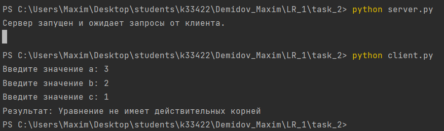

## Задача №2

Реализовать клиентскую и серверную часть приложения. Клиент запрашивает у сервера выполнение математической операции, параметры которой вводятся с клавиатуры. 
Сервер обрабатывает полученные данные и возвращает результат клиенту. 

Мой вариант, согласно списку группы, – решение квадратного уравнения.

## Решение

1. Сервер

```
import socket
import math

def solve_quadratic_equation(a, b, c):
    # Решение квадратного уравнения
    discriminant = b**2 - 4*a*c

    if discriminant > 0:
        x1 = (-b + math.sqrt(discriminant)) / (2*a)
        x2 = (-b - math.sqrt(discriminant)) / (2*a)
        return 'Корни уравнения: x1 = {:.2f}, x2 = {:.2f}'.format(x1, x2)
    elif discriminant == 0:
        x = -b / (2*a)
        return 'Уравнение имеет один корень: x = {:.2f}'.format(x)
    else:
        return 'Уравнение не имеет действительных корней'

def main():
    # Создаем сокет
    server_socket = socket.socket(socket.AF_INET, socket.SOCK_DGRAM)

    # Привязываем сокет к адресу и порту
    server_address = ('localhost', 12345)
    server_socket.bind(server_address)

    print('Сервер запущен и ожидает запросы от клиента.')

    while True:
        # Ждем получение запроса от клиента
        data, address = server_socket.recvfrom(1024)

        # Декодируем полученные данные
        params = data.decode('utf-8').split(',')

        # Извлекаем параметры a, b, c
        a = float(params[0])
        b = float(params[1])
        c = float(params[2])

        # Вычисляем решение квадратного уравнения
        result = solve_quadratic_equation(a, b, c)

        # Отправляем результат клиенту
        server_socket.sendto(result.encode('utf-8'), address)

if __name__ == '__main__':
    main()
```

2. Клиент

```
import socket

def main():
    # Создаем сокет
    client_socket = socket.socket(socket.AF_INET, socket.SOCK_DGRAM)

    # Адрес и порт сервера
    server_address = ('localhost', 12345)

    # Вводим параметры a, b, c с клавиатуры
    a = float(input('Введите значение a: '))
    b = float(input('Введите значение b: '))
    c = float(input('Введите значение c: '))

    # Формируем запрос в виде строки "a,b,c"
    request = '{},{},{}'.format(a, b, c)

    # Отправляем запрос серверу
    client_socket.sendto(request.encode('utf-8'), server_address)

    # Ждем получение результата от сервера
    data, address = client_socket.recvfrom(1024)

    # Декодируем полученные данные
    result = data.decode('utf-8')

    # Выводим результат
    print('Результат:', result)

if __name__ == '__main__':
    main()
```

## Пример работы программы
**Серверная и клиентская части**