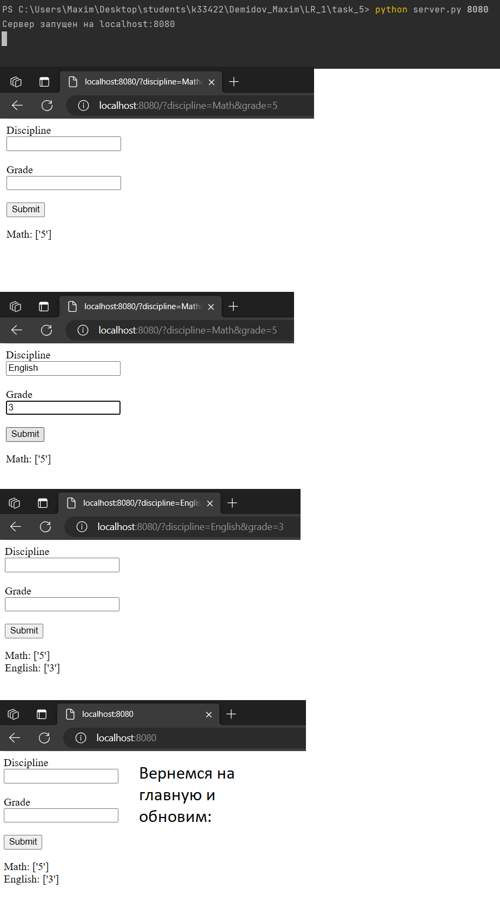

## Задание №5

Необходимо написать простой web-сервер для обработки GET и POST http
запросов средствами Python и библиотеки socket.

## Решение

1. Web-server

```
import socket
import sys

grades = {}


class MyHTTPServer:
    def __init__(self, host, port):
        self.host = host
        self.port = port

    def serve_forever(self):
        serv_sock = socket.socket(socket.AF_INET, socket.SOCK_STREAM)

        try:
            serv_sock.bind((self.host, self.port))
            serv_sock.listen()
            print(f"Сервер запущен на {self.host}:{self.port}")

            while True:
                conn, client_address = serv_sock.accept()
                print(f"Подключен клиент с адресом: {client_address}")
                try:
                    self.serve_client(conn)
                except Exception as e:
                    print('Fail', e)
        finally:
            serv_sock.close()

    def serve_client(self, client):
        try:
            req = self.parse_request(client)
            resp = self.handle_request(req)
            self.send_response(client, resp)
        except ConnectionResetError:
            client = None

        if client:
            client.close()

    def parse_request_line(self, rfile):
        line = rfile.readline()
        line = line.decode('utf-8')
        return line.split()

    def parse_request(self, conn):
        response_file = conn.makefile('rb')
        method, target, ver = self.parse_request_line(response_file)

        request = {'data': {}, 'method': method}
        if '?' in target:
            request['method'] = 'POST'
            values = target.split('?')[1].split('&')
            for value in values:
                a, b = value.split('=')
                request['data'][a] = b

        return request

    def handle_request(self, req):
        if req['method'] == 'POST':
            return self.handle_post(req)
        else:
            return self.handle_get()

    def handle_get(self):
        content_type = 'text/html; charset=utf-8'
        body = '<html><head><style></style></head><body>'
        body += '<form>'
        body += '<div><label for="discipline">Discipline</label><br>'
        body += '<input type="text" id="discipline" name="discipline"></div><br>'
        body += '<div><label for="grade">Grade</label><br>'
        body += '<input type="text" id="grade" name="grade"></div><br>'
        body += '<input type="submit" value="Submit"></form>'
        for subject in grades:
            body += f'<div><span>{subject}: {grades[subject]}</span></div>'
        body += '</body></html>'
        body = body.encode('utf-8')
        headers = [('Content-Type', content_type),
                   ('Content-Length', str(len(body)))]
        return Response(200, 'OK', headers, body)

    def handle_post(self, request):
        discipline = request['data']['discipline']
        grade = request['data']['grade']

        if discipline not in grades:
            grades[discipline] = []

        grades[discipline].append(grade)

        return self.handle_get()

    def send_response(self, conn, resp):
        response_file = conn.makefile('wb')
        status_line = f'HTTP/1.1 {resp.status} {resp.reason}\r\n'
        response_file.write(status_line.encode('utf-8'))

        if resp.headers:
            for (key, value) in resp.headers:
                header_line = f'{key}: {value}\r\n'
                response_file.write(header_line.encode('utf-8'))

        response_file.write(b'\r\n')

        if resp.body:
            response_file.write(resp.body)

        response_file.flush()
        response_file.close()


class Response:
    def __init__(self, status, reason, headers=None, body=None):
        self.status = status
        self.reason = reason
        self.headers = headers
        self.body = body


if __name__ == '__main__':
    if len(sys.argv) > 1:
        port = int(sys.argv[1])  # получаем порт из аргументов командной строки
    else:
        port = 8000  # порт по умолчанию

    server = MyHTTPServer('localhost', port)
    server.serve_forever()
```

## Пример работы программы
**Запуск сервера и добавление предметов:**